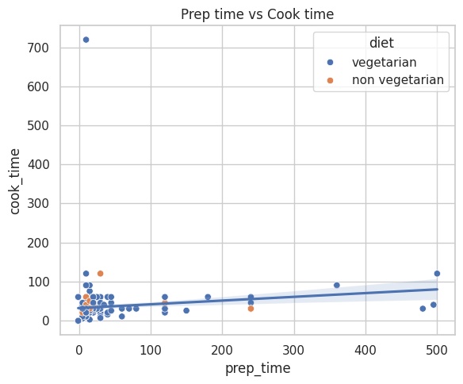

# Indian_Food
# Indian Food Visualizations

## Dataset
Short: Indian dishes dataset with columns: name, ingredients, diet, prep_time, cook_time, flavor_profile, course, state, region.

## What I did
- Performed EDA and cleaning.
- Plotted distributions, boxplots, scatter, and regional averages using seaborn/matplotlib.
- Saved plots to `/plots`.

## Visualizations (screenshots)

## Insights
- Most dishes in this dataset are vegetarian (~226 vs 29 non-veg).
- `prep_time` and `cook_time` are skewed right. Medians: prep=10, cook=30 (minutes).
- Correlation between prep and cook is low (~0.14). Long prep does not always mean long cook.
- Flavor profile is dominated by `spicy` and `sweet`. A placeholder value `-1` is present (cleaning needed).
- Some regions (South, East, North) show higher average prep times.
